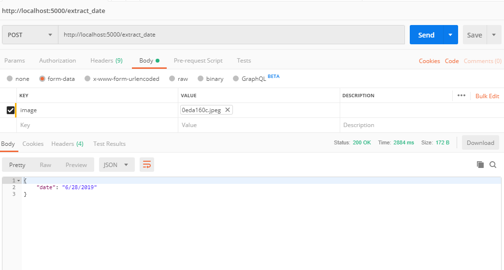

# Data-Extraction

## Approach used -
  - Used pytesseracrt to detect text from images
  - used regex to for extracting all the possible date formats in the detected text
  - used Flask to serve the app

## Results -

### Testing using Postman

