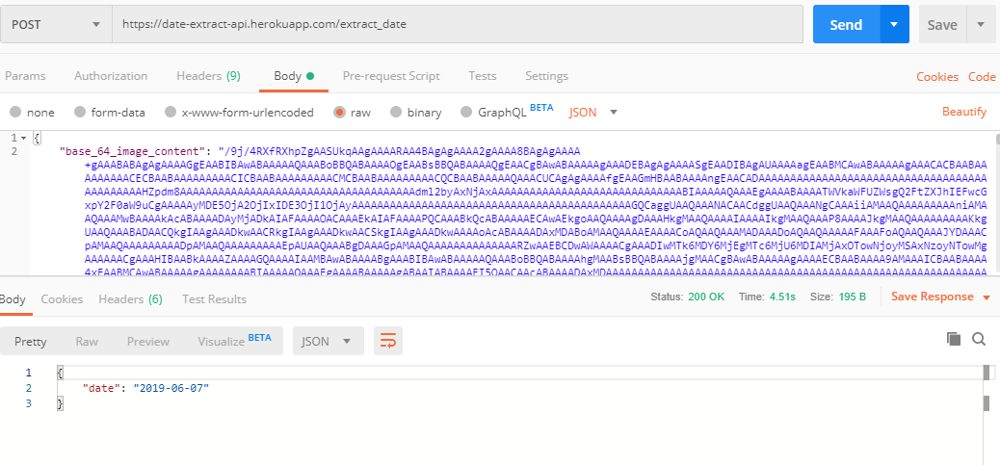

# Data-Extraction

The api is live at: https://date-extract-api.herokuapp.com/

To view working, please visit the testing section below.

## Approach used -
  - Used pytesseract to detect text from images
  - used regex for extracting all the possible date formats in the detected text
  - used Flask to serve the app
  - deployed to Heroku

## Results -

### Actual receipt image

### Testing using Postman

#### 1. Local

#### 2. Heroku

